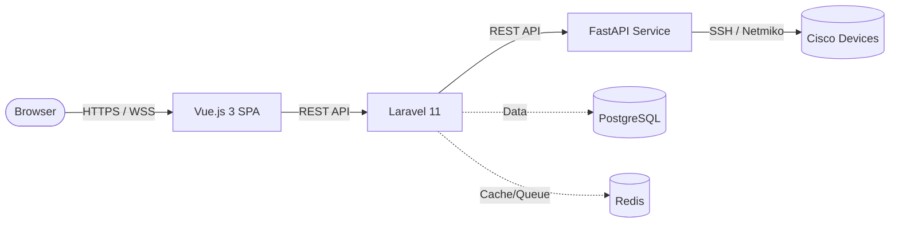

<div align="center">

# 🌐 Cisco Network Automation & Management Platform (NAMP)

**A centralized, professional web platform for managing and automating Cisco network infrastructure from a single dashboard.**

[](https://vuejs.org/)
[](https://laravel.com)
[](https://fastapi.tiangolo.com/)
[](https://python.org)
[](https://postgresql.org)
[](https://docker.com)

</div>

## 📖 Table of Contents

- [Overview](#-overview)
- [Architecture](#-architecture)
- [Key Features](#-key-features)
- [Getting Started](#-getting-started)
  - [Prerequisites](#prerequisites)
  - [Installation](#installation)
- [Development](#-development)
- [Security](#-security)
- [Project Structure](#-project-structure)
- [License](#-license)

## 🎯 Overview

Cisco NAMP is an enterprise-grade platform designed to streamline the administration of Cisco routers and switches. It bridges a modern Vue.js frontend with a robust Laravel API and a high-performance Python automation service, ensuring secure, fast, and reliable SSH orchestration to your network devices.

## 🏗️ Architecture



| Service | Technology | Port | Purpose |
| :--- | :--- | :--- | :--- |
| **Frontend** | Vue.js 3, Vite, Tailwind CSS | `80` | Admin dashboard SPA |
| **Backend** | Laravel 11, PHP 8.3 | `8000` | REST API, Auth, Business Logic |
| **Automation** | Python 3.12, FastAPI | `8001` | SSH Automation via Netmiko |
| **Database** | PostgreSQL 16 | `5432` | Persistent Storage |
| **Cache/Queue** | Redis 7 | `6379` | Sessions, Queues |

## ✨ Key Features

- **Centralized Dashboard**: Manage all your Cisco devices from a single pane of glass.
- **Secure Automation**: Execute commands via a dedicated FastAPI backend utilizing Netmiko.
- **Audit Logging**: Comprehensive logging of all actions and configuration changes.
- **Role-based Access**: Strict permission models with no public registration.
- **Preview & Approve**: Configuration changes require a preview and explicit approval before execution.

## 🚀 Getting Started

### Prerequisites

Ensure you have the following installed on your host machine:

- [Docker](https://docs.docker.com/get-docker/) & Docker Compose
- [Git](https://git-scm.com/downloads)

### Installation

1. **Clone the repository**

   ```bash
   git clone <repo-url> cisco-namp
   cd cisco-namp
   ```

2. **Configure the Environment**

   ```bash
   cp .env.example .env
   ```

   > ⚠️ **Important:** Edit `.env` and set your secure passwords, `APP_KEY`, and admin credentials.

   ```env
   ADMIN_EMAIL=admin@cisco-namp.local
   ADMIN_PASSWORD=<your-secure-password>
   ```

3. **Build and Start Services**

   ```bash
   docker compose up --build -d
   ```

4. **Initialize the Database**

   ```bash
   docker compose exec backend php artisan migrate --seed
   docker compose exec backend php artisan key:generate
   ```

5. **Access the Platform**
   - **Frontend UI:** `http://localhost`
   - **Backend API:** `http://localhost:8000/api`

## 🛠️ Development

Run the following commands for local development and testing:

```bash
# Frontend development (hot reload)
cd frontend && npm run dev

# Backend logs
docker compose logs -f backend

# Run Laravel backend tests
docker compose exec backend php artisan test

# Run Python FastAPI tests
docker compose exec automation pytest
```

## 🔒 Security

Security is a top priority for this platform:

- **Private Access:** No public registration — administrators must create all accounts manually.
- **Encryption at Rest:** All device credentials are encrypted using AES-256-CBC before storing in the database.
- **Internal Network:** The Python Automation (FastAPI) service is completely isolated on the internal Docker network and is never exposed publicly.
- **Auditing:** Every action executed on a device is audit-logged for compliance and tracking.
- **Restricted Execution:** The MVP only allows approved read-only commands by default.

## 📁 Project Structure

```text
cisco-namp/
├── automation/     # Python FastAPI service for SSH/Netmiko orchestration
├── backend/        # Laravel 11 REST API and core business logic
├── frontend/       # Vue.js 3 SPA with Tailwind CSS
├── docker-compose.yml
├── .env.example
└── README.md
```

## 📄 License

**Proprietary** — Internal Enterprise Use Only
